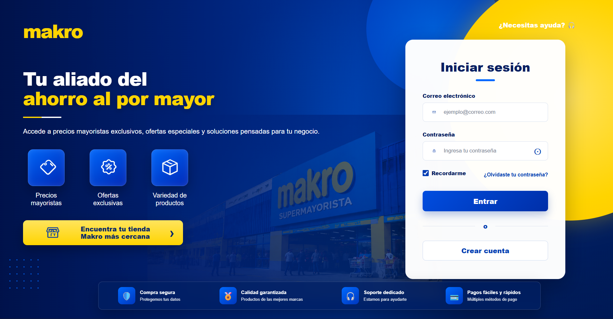
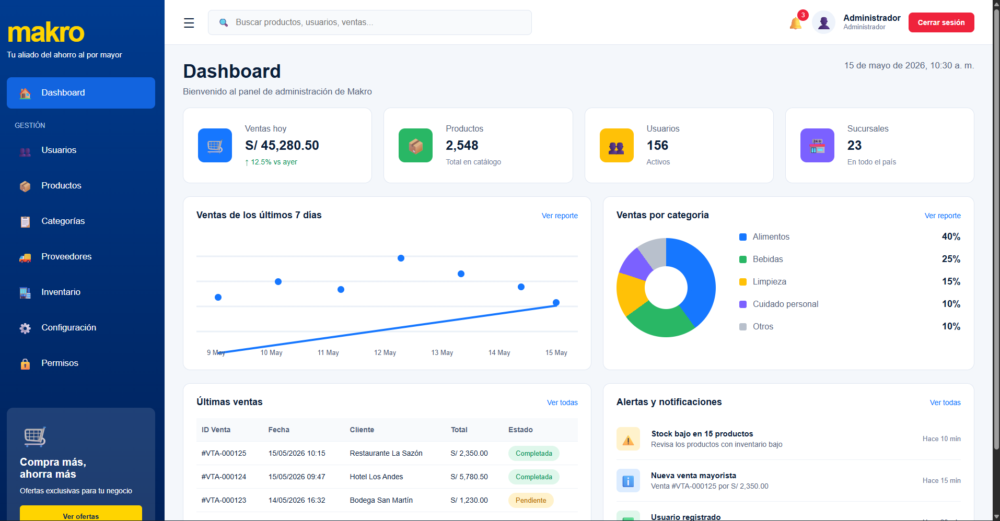
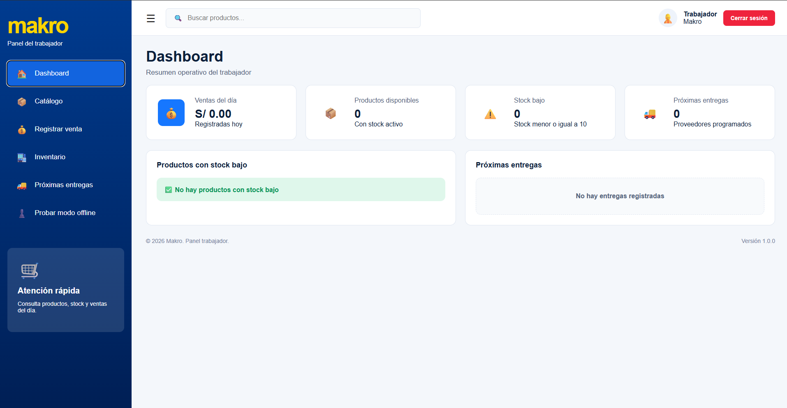

# Sistema Mayorista Full Stack

Aplicación web Full Stack desarrollada como proyecto personal para la gestión de operaciones de un negocio mayorista.

El sistema permite administrar usuarios, productos, proveedores, inventario y ventas mediante diferentes roles de acceso.

> Este es un proyecto personal/académico desarrollado con fines educativos y de portafolio. No es un sistema oficial ni está afiliado a Makro.

---

## Capturas del sistema

### Inicio de sesión



### Panel de administración



### Panel de trabajador



---

## Características

- Inicio de sesión de usuarios
- Gestión de usuarios
- Roles de administrador y trabajador
- Gestión de productos
- Registro y actualización de productos
- Carga de imágenes
- Control de stock
- Gestión de proveedores
- Registro de ventas
- Actualización de inventario
- Interfaz diferenciada según el rol del usuario
- API desarrollada con Node.js y Express
- Base de datos SQL Server
- Contraseñas protegidas mediante bcrypt
- Service Worker para funcionalidades web

---

## Tecnologías utilizadas

### Frontend

- HTML5
- CSS3
- JavaScript

### Backend

- Node.js
- Express.js

### Base de datos

- Microsoft SQL Server

### Librerías y herramientas

- bcrypt
- cors
- dotenv
- multer
- mssql
- msnodesqlv8
- nodemon
- Git
- GitHub

---

## Arquitectura

El proyecto utiliza una arquitectura cliente-servidor.

```text
Navegador
   │
   │ HTML / CSS / JavaScript
   ↓
Node.js + Express
   │
   │ API / consultas
   ↓
SQL Server
```git status